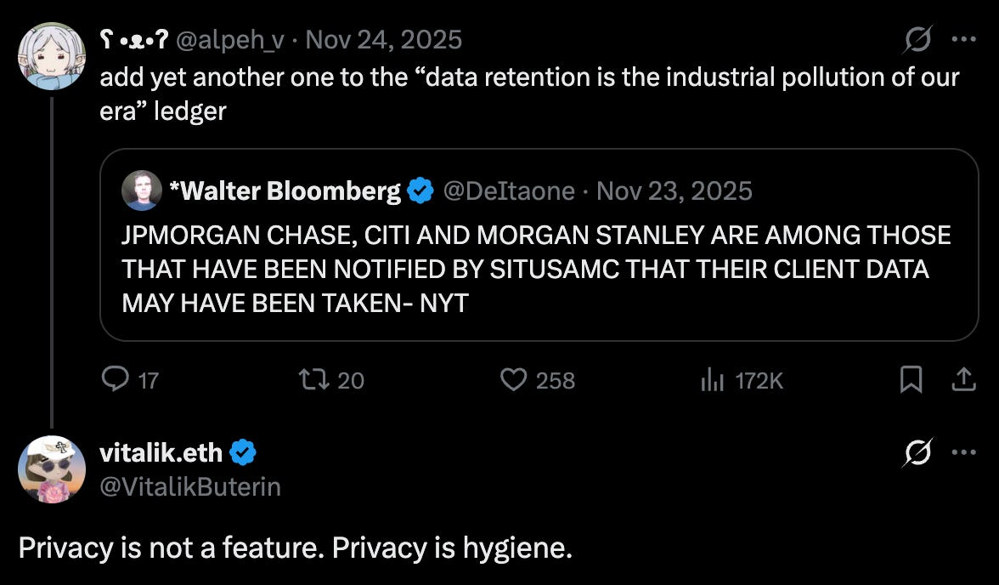
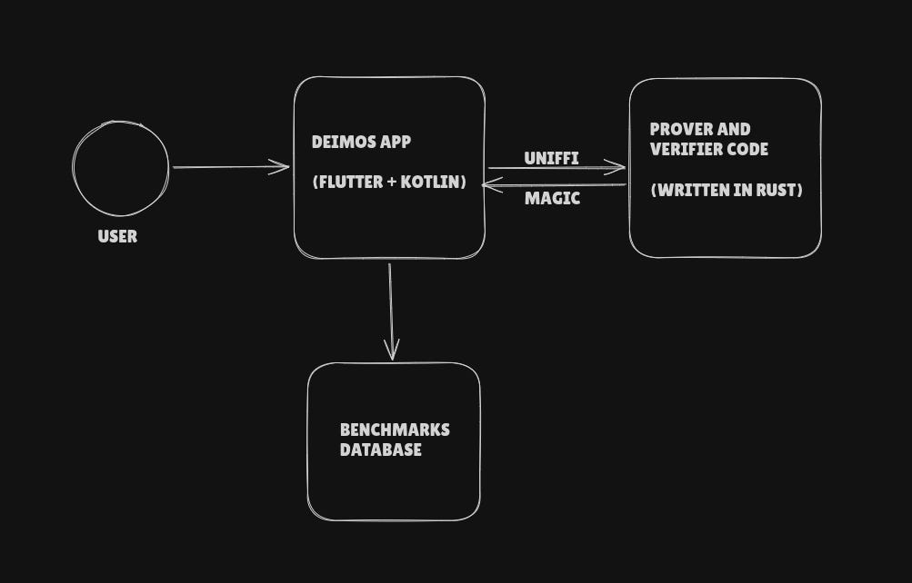

# My Experience of Building Deimos - Part 1 : Journey Begins

Welcome to the first article of a new series - where I will be documenting my journey and raw learnings of building **Deimos**. You may be wondering, what is [Deimos](https://github.com/BlocSoc-iitr/Deimos) ?(feel free to check out our Github by clicking the link and don't forget to star us! <3 ) It's a client side benchmarking initiative by _[BlocSoc IITR](https://blocsoc.eth.limo/)_. I'll dive into the technical weeds of the project, some below and mostly in the upcoming articles, but first, let's talk about how this project started and why it's so necessary. 

#### Identifying the Gap

This project started in mid August 2025. While exploring the ZK infrastructure, we identifyied a large gap: there was a massive lack of client-side benchmarks for proving and verifying common ZKP circuits across different provers.  
Sure, we have [csp-benchmarks](https://github.com/privacy-ethereum/csp-benchmarks) on [Ethproofs](https://ethproofs.org/csp-benchmarks). But they were proving on dedicated AWS for _Apple M1 CPU with 8 cores_. But what's missing was the benchmarks of the most common client device - the mobile phones. We imagine a future where privacy focused application can prove and verify ZKP circuits on mobile devices. But they need data for making the right choice of circuits and provers. Making that data and insights available is our mission.

#### Why Client Side ?

This [article](https://pse.dev/blog/client-side-gpu-everyday-ef-privacy) by PSE team accurately describe the problem - ZK circuits proven on server are not actually "zero-knowledge" , they have a serious risk of leaking sensitive data (private inputs) which are often needed to be hidden as part of maintaining privacy.  
I will highly suggest reading the article. It also covers some hot topics around client side proving.

#### Building on top of Mopro

With the problem defined, we entered the research and architecture phase. The initial groundwork and architectural planning were laid out by my amazing seniors - [Utsav ](https://x.com/0x_senpai_x) and [Sambhav](https://x.com/0x_Wyrm) (Here's the link to [first commit](https://github.com/BlocSoc-iitr/Deimos/commit/5ffde5606c9167bf0aa81b2a57cf2f94dfaa3d02)), they are also leading this project.

We decided to scaffold Deimos on top of [Mopro](https://github.com/zkmopro/mopro) . It's a project by PSE and is under active development. According to their github :

> _Mopro (Mobile Prover) is a toolkit for ZK app development on mobile. Mopro makes client-side proving on mobile simple._

And indeed it gave us a good ground to work on. As we traverse along this series, I will regularly talk and explain about the relevant parts of the Mopro. But If you want to read about it in greater detail right now, I highly recommend exploring their fantastic [documentation](https://zkmopro.org/docs/intro/).  

#### Journey Begins !

My first month was pure research and exploration, in which I explored and tried Mopro and spent hours reading it's wonderful [docs](https://zkmopro.org/docs/intro/). I understood how it worked and how was everything connected from integration to proving. Also I was handling the Circom circuits initially, which meant I had to learn how to write them and figure out how to prove and verify them using the CLI. 

Although Mopro supports various framework for app integration ( such as React Native, Kotlin etc) but we found by trial and lots of errors that the Flutter was by far the easiest to integrate and build our app with. With that, next thing was to design a suitable architecture.

#### Deimos in Nutshell : The Architecture

The above image provide a high level overview of the app's architecture. In the following lectures we will tackle each part in great depth.  
Basic Flow is like this : User run the benchmarks -> Frontend calls the appropriate Rust code using uniFFI ( We will explore this wonderful thing in next article) -> Values get returned to Frontend -> Various benchmarks are recorded in the process -> Benchmarks are sent to the database and are displayed on the website.

Although this seems simple, it has a lot of technical depth ( I also experienced this only while actually working on this project ).  
  
This concludes our 1st article but this is just the beginning, Stay tuned for Part 2, where we will dive deep into the magic of bridging Rust and Flutter with UniFFI.

You might want to [follow](https://x.com/AnIdiotJimJam) me on X and subscribe to my substack :) so that you don't miss the next articles.  
  
Other Relevant Links: 

  * [Deimos X account](https://x.com/Deimos_Labs)

  * [Deimos Website ](https://deimos-werw.vercel.app/)
