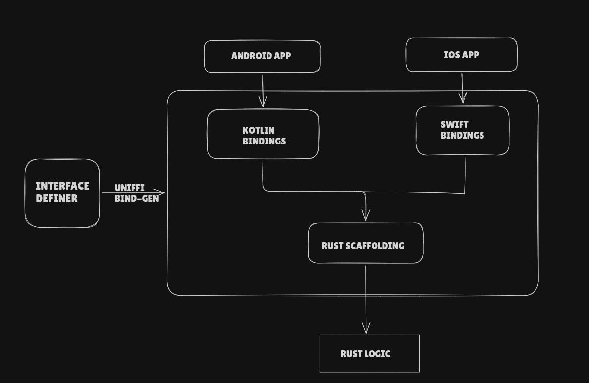
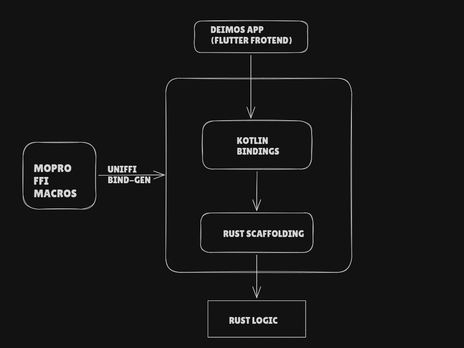
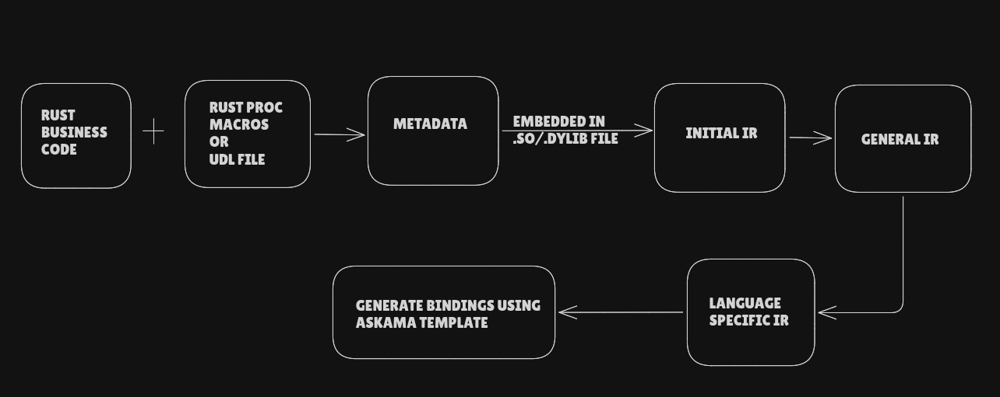
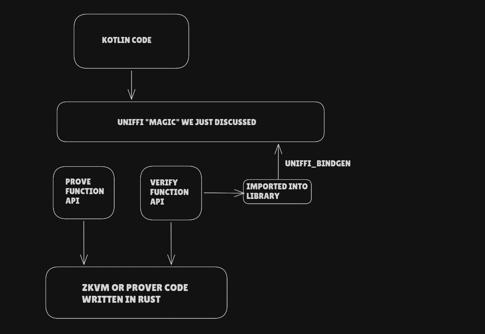

# My Experience of Building Deimos - Part 2 : UniFFI Magic

Imagine you are a Rustacean like me. You write your software logic in Rust. You are happy, but suddenly you realize you need to write Kotlin code to use that logic in an Android app. You're worried, but you have two options:  
- Rewrite into Kotlin like a normie   
- Use UniFFI like a true rustacean 🦀

>  _Note: There are other options such as using[wasm bindings](https://github.com/wasm-bindgen/wasm-bindgen) which is used by mopro for web apps but that is not our focus currently and so we are putting that out of scope for this article_

Welcome back to the second article of the series where I share my raw learning and expereince building Deimos. If you want to know what I am talking about, read the previous article [here](https://open.substack.com/pub/jimjam908460/p/my-experience-of-building-deimos?r=6t71oe&utm_campaign=post&utm_medium=web).

This article will attempt to break down this amazing piece of code, how it works under the abstraction, how you can use it, and finally, how it is used in **Deimos.**

### Motivation

The Original motivation is well presented in the [original proposal](https://github.com/mozilla/uniffi-rs/blob/main/docs/adr/0000-whats-the-big-idea.md). It consider the four choices we also initially faced, and they valued each option with its pros and cons. The only percieved con of developing UniFFI option was the risk of it bearing less fruit then the time spent on it. Fortunately that didn't turn out to be true and it provided a much higher return.

### We Gotta make Bindings

Our goal is to call code written in rust through different programming languages -formally known as a _Foreign Function Interface (FFI)._ This is done by generating foreign-language bindings that target Rust libraries. Currently UniFFI fully supports Python, Kotlin, and Swift, with partial legacy support for Ruby. In this article, we will demonstrate using Kotlin, because it's the one most relevant to Deimos. 

This is how bindings communicate with the logic code:

Let's zoom in at the architecture of Deimos App ( I have isolated the architecture for Android app for a better explanation, though there is equivalent architecture for iOS as well) 

The parts sandwhiched between the Deimos App and Rust Logic is the abstraction we called "UniFFI Magic" in the [previous article](https://open.substack.com/pub/jimjam908460/p/my-experience-of-building-deimos?r=6t71oe&utm_campaign=post&utm_medium=web).

Let's go through a hands-on tutorial to really understand what it does and then we will pop open the hood.

This is our very _crucial_ business logic that we want to call from a different language
[code]
    fn product(a: u32, b: u32) -> u32 {
        a * b
    }
[/code]

We are creating a "math" library. So we will start with 𝚌𝚊𝚛𝚐𝚘 𝚗𝚎𝚠 \--𝚕𝚒𝚋 𝚖𝚊𝚝𝚑 and add our code to 𝚕𝚒𝚋.𝚛𝚜. Next, append the following to 𝙲𝚊𝚛𝚐𝚘.𝚝𝚘𝚖𝚕. (I have used v0.31.0, which is the latest at the time of writing this article).
[code]
    [dependencies]
    uniffi = { version = "0.31.0", features = [ "cli" ] }
    
    [build-dependencies]
    uniffi = { version = "0.31.0", features = [ "build" ] }
    
    [lib]
    crate-type = ["cdylib"]
    name = "math" # This is our crate name in this tutorial
[/code]

𝚌𝚍𝚢𝚕𝚒𝚋 is used to create a dynamic library that can be called by our Kotlin code.   
Next, we have to define the interface and scaffold it. The interface can be defined in two ways: through [a UDL file](https://mozilla.github.io/uniffi-rs/latest/tutorial/udl_file.html), or proc macros. We are using the latter for simplicity. Scaffolding is as simple as adding a macro at the top (we will see what happens under the hood later ).  
With these changes, our lib.rs looks like this:
[code]
    uniffi::setup_scaffolding!();
    
    #[uniffi::export]
    fn product(a: u32, b: u32) -> u32 {
        a*b
    }
[/code]

Last step is to actually create bindings! For that we will create a binary and then run it.
[code]
    [[bin]]
    # This can be whatever name makes sense for your project, but the rest of this tutorial assumes uniffi-bindgen.
    name = "uniffi-bindgen"
    path = "bin/uniffi-bindgen.rs"
    
[/code]

And here is the content of the file 𝚋𝚒𝚗/𝚞𝚗𝚒𝚏𝚏𝚒-𝚋𝚒𝚗𝚍𝚐𝚎𝚗.𝚛𝚜
[code]
    fn main() {
        uniffi::uniffi_bindgen_main()
    }
[/code]

We are pretty much done now ! Just run the binary we just created using the command below :
[code]
    cargo build --release && cargo run --bin uniffi-bindgen generate --library target/release/libmath.so --language kotlin --out-dir out
[/code]

And voila, we have generated the bindings!. The output has two parts: 𝚕𝚒𝚋𝚖𝚊𝚝𝚑.𝚜𝚘 (the library containg native code) and math.kt (a wrapper containing Kotlin-specific code that calls the library, which we generated by setting the flag -- 𝚕𝚊𝚗𝚐𝚊𝚞𝚐𝚎 𝚔𝚘𝚝𝚕𝚒𝚗).

Now, let's use these bindings to do our _critical_ operation. Make a file called main.kt at the same location as math.kt.
[code]
    import uniffi.math.*
    
    fun main() {
        val a: UInt = 5u
        val b: UInt = 7u
        val res = product(a, b)
        println("Result of $a * $b is $res")
    }
[/code]

You can run this code following the step in the [github repo](https://github.com/AnInsaneJimJam/uniffi_tutorial), I made for this article. It includes a script for setting up Kotlin, compiling, and running the code. It also has a meaningful commit history to help you follow along.
[code]
    Checking for JNA library...
    Compiling Kotlin files...
    Running output...
    Result of 5 * 7 is 35
[/code]

Hooray ! We have done it. We executed our _critcal_ operation through Kotlin without writing any Kotlin logic.

### Revealing the trick

 _This section can be skipped without losing any context for the future, but the curious ones should stick around._

Just like all great magic tricks boil down to cleverness and illusion, our UniFFI "magic" is the result of great architectural design and clever engineering. Let's look at both from a wanderer's perspective.

There are 5 main steps in the flow:

  1. **Metadata Preparation :** During 𝚌𝚊𝚛𝚐𝚘 𝚋𝚞𝚒𝚕𝚍, our Rust code is converted from a Rust AST (Abstract Syntax Tree) to flat metadata arrays using the interface defined by the macros (or UDL file). The next step runs the 𝚞𝚗𝚒𝚏𝚏𝚒-𝚋𝚒𝚗𝚍𝚐𝚎𝚗 binary, which embeds this metadata directly into the compiled `.so` or `.𝚍𝚢𝚕𝚒𝚋` library.

  2. **Initial IR Generation:** The flat list of metadata is converted back into a structured hierarchical tree. Think of this as generating a theoretical interface definition. Essentially we converted Rust AST to language-agnostic structured hierarchical tree.

  3. **General IR Generation:** The Initial IR is transformed into the General IR. This essentially bridges the gap between the purely theoretical interface definition and the physical C-FFI reality. It iterates over every node of the tree and computes the exact FFI mechanics needed for each item.

  4. **Language Specific IR :** he General IR gets transformed into the Language-Specific IR. This involves incorporating language-specific details. For example, resolving intermediate `UInt64` types to `Long` in Kotlin, or reformatting function names to match the target language's naming conventions.

  5. **Code Generation using Askama :** Finally, the IR is converted into language-specific code. `Math.kt` was generated as a result of this stage.

This completes the binding generation. But how does the actual execution work?

##### Execution Flow:

Calling Kotlin Code -> Data types are converted to adequate C types (e.g., `u8`, `i32`, `f64`, pointers) through a process called **Kotlin lowering** -> The Rust binary is called -> C code handles the type conversion into Rust types (**Rust lifting**) -> The Rust logic is executed -> The output is converted back to C types (**Rust lowering**) -> Finally, the output is converted back to Kotlin types (**Kotlin lifting**).

_Lowering_ and _Lifting_ refer to the type conversion between higher-level languages and lower-level ones, and vice versa.

This topic could be a separate article on its own, but I've tried to extract just enough juice to give you a solid understanding. Let's move on.

### Deimos Part Finally …

This section acts as an introductory bridge to upcoming articles. We are now moving into the "Prover Rust Backend" territory of the Deimos architecture we talked about in the previous article. Consider this a warm-up before we dive into different zkVMs and Provers. Let's see how UniFFI is used in Deimos (or Mopro).

We can import any zkVM or Prover API into our library and generate bindings for it. Mopro makes this even easier for us. The `mopro-cli` provides a lot of customizable boilerplate code, which is why we chose to scaffold Deimos on top of it. It even provides boilerplate Kotlin and Swift code!  
  
This wraps up this article and provides a solid foundation that we will build upon in future articles, where we will integrate different zkVMs and Provers.  

### Useful Links:

  * Mopro Docs: <https://zkmopro.org/docs/intro>

  * UniFFI user guide: [https://mozilla.github.io/uniffi-rs/](https://mozilla.github.io/uniffi-rs/latest/Getting_started.html)

  * UniFFI-rs github: <https://github.com/mozilla/uniffi-rs>

  * Repo for this article: <https://github.com/AnInsaneJimJam/uniffi_tutorial>

Don't forget to check the previous article if you have not read it
